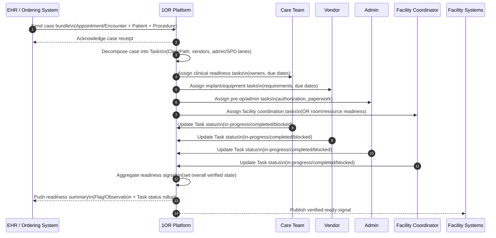

This page describes how the logical model is applied using FHIR. This specification is a work in progress and is intended to capture the current state of our thinking on how FHIR resources can be used to support the 1OR workflow. It is not intended to be a complete or final specification, but rather a snapshot of our current understanding and approach.

FHIR Resources that fit well:

- Appointment - Case Schedule (time, location)
- Procedure or HealthcareService - Surgical Procedure details
- Patient - Patient identity
- Practitioner, PractitionerRole - Surgical team members
- Location, Organization - Facility and OR details
- Device - Equipment and implants

Potential FHIR Resources:

- Task - Workflow management for pre-op tasks (e.g., pre-op checklist, equipment prep)
- CareTeam - Coordination of the surgical team and their roles
- ServiceRequest - Initial surgical order and intent
- Observation - Tracking the status of various readiness tasks (e.g., pre-op labs, anesthesia clearance)
- Flag - Indicating critical alerts or readiness status (e.g., red/yellow/green status for case readiness)
- CommunicationRequest - Notifications and communication with stakeholders (e.g., patient, surgical team, vendors)
- AuditEvent, Provenance - Tracking actions and changes for accountability and attribution

FHIR Fit to purpose:

| Function               | FHIR    | 1OR     |
| ---------------------- | ------- | ------- |
| Case representation    | Yes     | Yes     |
| Scheduling             | Yes     | No      |
| Data standardization   | Yes     | Partial |
| Vendor coordination    | Limited | Core    |
| Task orchestration     | Limited | Core    |
| Readiness verification | No      | Core    |
| Attribution & ROI      | No      | Core    |
{: .grid}

- Inbound: EHR sends the initial case (Appointment/Encounter + Patient + Procedure).
- Inside 1OR: The case is broken into Task resources (core orchestration for ClearPath checklists, vendor requirements, admin/SPD lanes, ownership, due dates, and escalations).
- Acknowledgements: Parties update Task status → 1OR aggregates and sets the overall verified state.
- Outbound: We push readiness signals and Task status summaries back to the EHR/facility (Flag or Observation for “verified-ready” status). This gives the EHR one clean source of truth without forcing double-entry. - FUTURE NOT CORE NOW.

### Sequence Diagram for OR coordination

