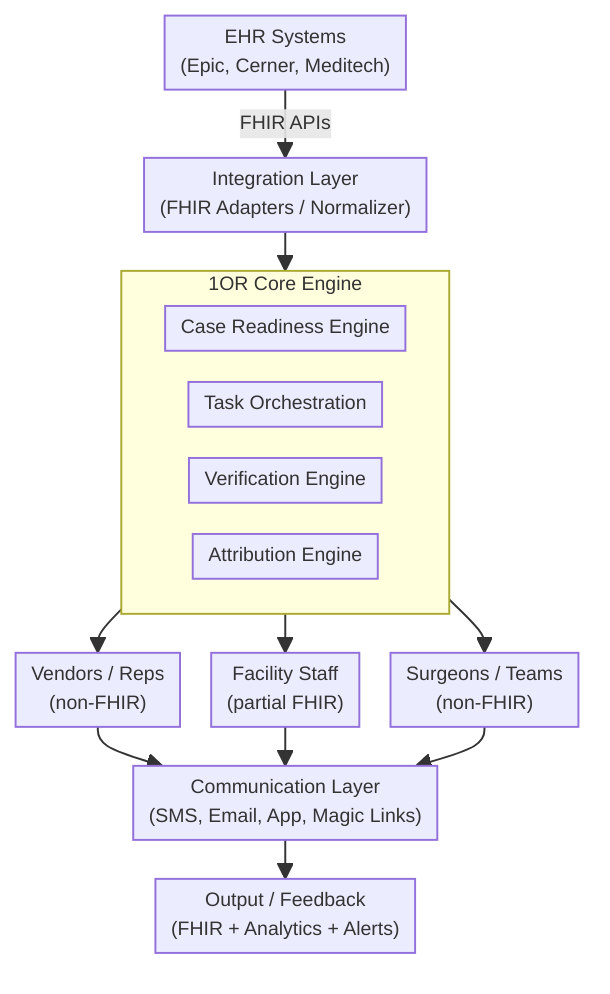
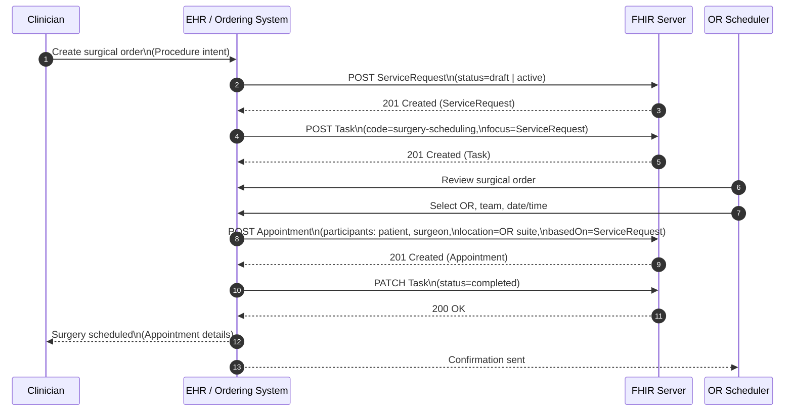
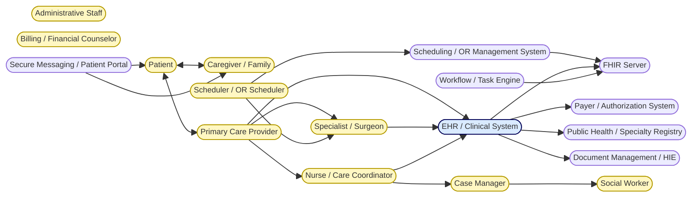

This IG is a project of [1OR Health](https://1orhealth.com/), a company dedicated to improving the efficiency and safety of operating room (OR) coordination through the use of FHIR standards. 

The goal of this IG is to provide a framework for coordinating the various tasks and resources involved in surgical procedures, including scheduling, team coordination, equipment management, and patient care. By leveraging FHIR resources such as ServiceRequest, Task, Appointment, and CareTeam, this IG aims to streamline the OR coordination process, reduce errors, and enhance communication among healthcare providers.

The IG includes a logical model for OR coordination, sequence diagrams illustrating the workflow, and a flowchart depicting the coordination of actors involved in the surgical process. Additionally, the IG provides downloadable artifacts and examples in multiple formats, as well as a cross-version analysis and dependency tables to facilitate implementation.

### Executive Summary

TODO: This section will need to be updated.

1OR is designed as a **cross-system orchestration and verification layer** for surgical readiness.

While existing systems (EHRs, scheduling platforms) represent **scheduled intent**, 1OR is
responsible for establishing **verified operational readiness** across all stakeholders involved in a
surgical case.

**FHIR** represents scheduled intent.

**1OR** represents verified readiness.

This document outlines:

- How 1OR integrates with EHR systems using FHIR
- Where FHIR is leveraged vs. where 1OR extends beyond it
- The internal data model powering readiness verification
- A proposed architecture for alignment with the OR Coordination IG

#### High-Level Architecture

Leverage FHIR for Data Ingestion, and Output (status, signaling, reporting). However, when FHIR is not sufficient then other standards like HL7 v2, or custom APIs can be used. Note that FHIR is only proposed as an interface standard, not as the internal data model.

FHIR Resources that fit well
- Appointment - Case Schedule (time, location)
- Procedure or HealthcareService - Surgical Procedure details
- Patient - Patient identity
- Practitioner, PractitionerRole - Surgical team members
- Location, Organization - Facility and OR details
- Device - Equipment and implants

Potential FHIR Resources:
- Task - Workflow management for pre-op tasks (e.g., pre-op checklist, equipment prep)
- CareTeam - Coordination of the surgical team and their roles
- ServiceRequest - Initial surgical order and intent
- Observation - Tracking the status of various readiness tasks (e.g., pre-op labs, anesthesia clearance)
- Flag - Indicating critical alerts or readiness status (e.g., red/yellow/green status for case readiness)
- CommunicationRequest - Notifications and communication with stakeholders (e.g., patient, surgical team, vendors)
- AuditEvent, Provenance - Tracking actions and changes for accountability and attribution

The need:
- Vendor confirmation or participation
- Readiness verification across stakeholders
- Responsibility ownership
- Real-time coordination
- Delay attribution
- Preventable cancellation logic

FHIR Fit to purpose:

| Function | FHIR | 1OR |
|---|---|---|
| Case representation | Yes | Yes |
| Scheduling | Yes | No |
| Data standardization | Yes | Partial |
| Vendor coordination | Limited | Core |
| Task orchestration | Limited | Core |
| Readiness verification | No | Core |
| Attribution & ROI | No | Core |
{: .grid}

### Logical Model for OR coordination

The logical model for OR coordination includes the following key components:

- [Case](StructureDefinition-Case.html): Represents the overall surgical case, including patient information, procedure details, and scheduling information.
- [Task](StructureDefinition-Task.html): Represents individual tasks that need to be completed as part of the surgical preparation process, such as pre-operative assessments, equipment preparation, and team coordination.
- [Verification](StructureDefinition-Verification.html): Represents the verification of readiness for each task, including the responsible party, status, and any relevant notes or attachments.
- [EventTimeline](StructureDefinition-EventTimeline.html): Represents significant events in the surgical preparation process, such as task completion, delays, or cancellations, along with their timestamps and responsible parties.
- [Attribution](StructureDefinition-Attribution.html): Represents the attribution of responsibility for tasks and events, including the individuals or teams responsible and any relevant details.

### Sequence Diagram for OR coordination

### Coordination of Actors

