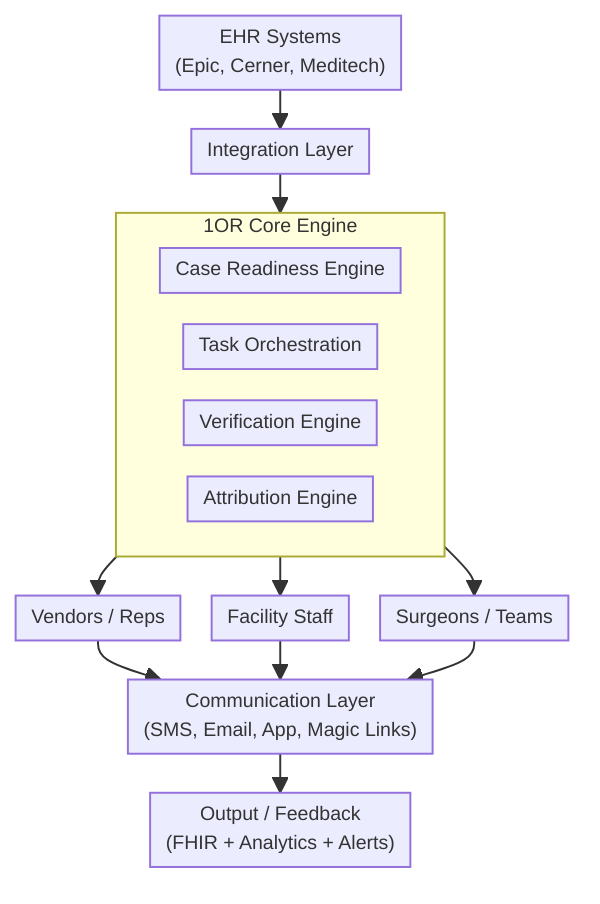

This page describes the logical model for 1OR, outlining the core concepts, actors, and interactions that define how 1OR functions as a cross-system orchestration layer for surgical readiness. This model serves as technology independent foundation for understanding how 1OR integrates with existing systems and coordinates the various stakeholders involved in preparing for a surgical case.

### High-Level Architecture

### Coordination of Participants

There are several key people involved in the coordination of surgical cases, including:

- The Patient
- Primary Care Provider (PCP)
- Patient family or caregiver
- Surgeons
- surgical teams
- Anesthesia teams
- Sterile processing teams
- Schedulers
- administrative staff

These people interact with real-world systems:

- EHR systems (e.g., Epic, Cerner) for case information and scheduling
- Scheduling platforms for OR management
- Payer systems
- Public Health registries
- Messaging platforms
- Implant source
- Facility management systems

These Systems interact:

- Requested procedure / case
- Itemization of tasks and participating parties
- Task assignment and ownership
- Task status and updates
- driving to verified state

To Achieve:

- Verified readiness across all stakeholders
- Vendor confirmation or participation
- Readiness verification across stakeholders
- Responsibility ownership
- Real-time coordination
- Delay attribution
- Preventable cancellation logic

### Actors and Interactions

The Actors are abstracted roles that participate in the system. Actors are limited to Interoperability roles. People interact with Actors, but this is outside the scope of this Interoperability IG. 

- Procedure Initiator -- case or procedure initiating
- Procedure Coordinator -- scheduling
- Vendor Representative -- implant/equipment readiness
- Sterile Processing (SPD) -- instrument readiness
- Facility or OR Administration -- facility-side coordination
- Clinical System -- case information
- Task Orchestration System -- 1OR

Interactions:

- Creation of a procedure event, typically initiated by a surgeon or scheduler
- Distribution of coordination tasks to relevant actors such as vendor, SPD, and facility roles
- Notification of those actors that action is required
- Acknowledgement and completion of assigned tasks by each actor
- Ongoing updates to procedure readiness status based on task completion
- Visibility of overall readiness across all actors

### Logical Model for OR coordination

The logical model for OR coordination includes the following key components:

- [Case](StructureDefinition-Case.html): Represents the scheduled surgical case, including patient information, procedure details, and scheduling information.
- [Task](StructureDefinition-Task.html): Represents individual tasks that need to be completed as part of the surgical preparation process, such as pre-operative assessments, equipment preparation, and team coordination.
- [Verification](StructureDefinition-Verification.html): Represents the verification of readiness for each task, including the responsible party, status, and any relevant notes or attachments.
- [EventTimeline](StructureDefinition-EventTimeline.html): Represents significant events in the surgical preparation process, such as task completion, delays, or cancellations, along with their timestamps and responsible parties.
- [Attribution](StructureDefinition-Attribution.html): Represents the attribution of responsibility for tasks and events, including the individuals or teams responsible and any relevant details.

